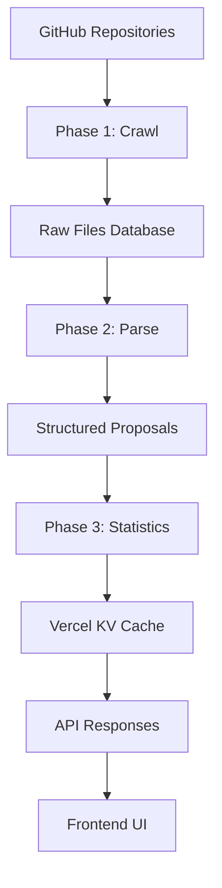

# DIP Analytics Platform

A comprehensive analytics platform for Decentralized Improvement Proposals (DIPs) across multiple blockchain protocols. Track proposal statistics, author analytics, and governance trends for Ethereum EIPs, Polygon PIPs, Starknet SNIPs, and Rollup RIPs.

## 🌟 Features

- **Multi-Protocol Support**: Ethereum, Polygon, Starknet, Rollup protocols
- **Advanced Analytics**: Author influence scores, acceptance rates, track breakdowns
- **Smart Caching**: Efficient data collection with GitHub SHA comparison
- **Real-time Search**: Filter by status, track, author, and text search
- **Pull Request Creation**: Submit new proposals directly through the interface
- **Responsive Design**: Modern UI built with Mantine and Next.js 15

## 🚀 Quick Start

### Prerequisites

- Node.js 18+
- pnpm (recommended package manager)
- GitHub token with repository access
- Vercel KV database
- PostgreSQL database

### Installation

1. **Clone the repository**
   ```bash
   git clone <repository-url>
   cd dip-frontend
   ```

2. **Install dependencies**
   ```bash
   pnpm install
   ```

3. **Set up environment variables**
   ```bash
   cp .env.example .env.local
   # Edit .env.local with your configuration
   ```

4. **Generate Prisma client**
   ```bash
   pnpm prisma:generate
   ```

5. **Start development server**
   ```bash
   pnpm dev
   ```

## 📋 Available Scripts

### Development Commands

```bash
# Start development server
pnpm dev

# Start with mainnet configuration
pnpm dev:mainnet

# Build for production
pnpm build

# Start production server
pnpm start

# Run linter
pnpm lint
```

### Data Pipeline Commands

The platform uses a 3-phase data pipeline for robust data processing:

```bash
# Full data refresh (all protocols, all phases)
pnpm data:refresh

# Individual phases
pnpm data:crawl      # Phase 1: Crawl raw files from GitHub
pnpm data:parse      # Phase 2: Parse stored raw files
pnpm data:stats      # Phase 3: Generate statistics and cache

# Protocol-specific operations
pnpm data:crawl:ethereum   # Crawl only Ethereum EIPs
pnpm data:crawl:polygon    # Crawl only Polygon PIPs
pnpm data:crawl:starknet   # Crawl only Starknet SNIPs
pnpm data:crawl:rollup     # Crawl only Rollup RIPs

# Check data status
pnpm data:status
```

### Database Commands

```bash
# Generate Prisma client
pnpm prisma:generate

# View database in Prisma Studio
pnpm prisma:studio

# Apply database migrations
pnpm prisma:migrate

# Reset database (development only)
pnpm prisma:reset
```

## 🏗️ Architecture

### Data Pipeline

The platform uses a **3-phase pipeline** for robust data processing:

#### Phase 1: Crawling 🕷️
- **Pure crawler** with smart caching
- Fetches raw markdown files from GitHub repositories
- **Smart caching**: Uses SHA comparison to skip unchanged files
- Stores raw documents in database (no parsing at this stage)
- **Never loses data** due to parsing failures

#### Phase 2: Parsing 📝
- Processes stored raw files independently
- Extracts frontmatter (title, author, status, etc.)
- Protocol-specific parsing logic for different proposal formats
- Handles parsing errors gracefully without affecting raw data

#### Phase 3: Statistics 📊
- Generates analytics from parsed proposals
- Author influence scores, acceptance rates, track breakdowns
- Caches results in Vercel KV for fast API responses
- Cross-protocol aggregation and normalization

### API Endpoints

#### Data Pipeline
```bash
# Full pipeline (all phases)
curl -X POST "http://localhost:3000/api/cron/generate-static"

# Individual phases
curl -X POST "http://localhost:3000/api/cron/generate-static?phase=crawl"
curl -X POST "http://localhost:3000/api/cron/generate-static?phase=parse"
curl -X POST "http://localhost:3000/api/cron/generate-static?phase=stats"

# Protocol-specific processing
curl -X POST "http://localhost:3000/api/cron/generate-static?protocol=polygon"
curl -X POST "http://localhost:3000/api/cron/generate-static?phase=crawl&protocol=ethereum"
```

#### Proposals API
```bash
# Get proposals list
curl "http://localhost:3000/api/eips/list?protocol=ethereum"
curl "http://localhost:3000/api/eips/list?protocol=polygon&status=Draft&track=App"

# Get specific proposal
curl "http://localhost:3000/api/eips/ethereum/1"

# Search proposals
curl "http://localhost:3000/api/eips/list?protocol=ethereum&search=token&page=1&limit=10"
```

#### Analytics API
```bash
# Protocol statistics
curl "http://localhost:3000/api/stats/ethereum"

# Author analytics
curl "http://localhost:3000/api/authors/ethereum"
```

### Domain Structure

The platform supports multi-tenant architecture with protocol-specific subdomains:

- `ethereum.dip.box` - Ethereum EIPs
- `polygon.dip.box` - Polygon PIPs
- `starknet.dip.box` - Starknet SNIPs
- `rollup.dip.box` - Rollup RIPs
- `dip.box` - Main dashboard with cross-protocol analytics

## 🔧 Configuration

### Environment Variables

Create `.env.local` with the following variables:

```bash
# Database
DATABASE_URL="postgresql://..."
KV_URL="redis://..."
KV_REST_API_URL="https://..."
KV_REST_API_TOKEN="..."

# GitHub Integration
GITHUB_TOKEN="ghp_..."
GITHUB_CLIENT_ID="..."
GITHUB_CLIENT_SECRET="..."
GITHUB_WEBHOOK_SECRET="..."

# Repository Configuration (Optional - defaults provided)
NEXT_PUBLIC_ETHEREUM_REPO_OWNER="ethereum"
NEXT_PUBLIC_ETHEREUM_REPO_NAME="EIPs"
NEXT_PUBLIC_POLYGON_REPO_OWNER="maticnetwork"
NEXT_PUBLIC_POLYGON_REPO_NAME="Polygon-Improvement-Proposals"

# Deployment
NEXT_PUBLIC_BASE_URL="https://dip.box"
NEXT_PUBLIC_AUTH_DOMAIN="auth.dip.box"
```

### Supported Protocols

| Protocol | Repository | Folder | Prefix | Status |
|----------|------------|--------|--------|--------|
| Ethereum | ethereum/EIPs | EIPS | EIP | ✅ Active |
| Polygon | maticnetwork/Polygon-Improvement-Proposals | PIPs | PIP | ✅ Active |
| Starknet | starknet-io/SNIPs | SNIPS | SNIP | ✅ Active |
| Rollup | ethereum/RIPs | RIPS | RIP | ✅ Active |

## 📊 Data Flow



## 🛠️ Development

### Adding New Protocols

1. **Add repository configuration** in `app/api/cron/generate-static/route.ts`:
   ```typescript
   {
     owner: "protocol-org",
     repo: "Protocol-Improvement-Proposals",
     branch: "main",
     eipsFolder: "PIPs",
     protocol: "myprotocol",
     proposalPrefix: "PIP",
     enabled: true,
     description: "My Protocol Improvement Proposals",
   }
   ```

2. **Add protocol config** in `lib/subdomain-utils.ts`:
   ```typescript
   myprotocol: {
     name: "My Protocol",
     repoOwner: "protocol-org",
     repoName: "Protocol-Improvement-Proposals",
     proposalPrefix: "PIP",
     description: "My Protocol Improvement Proposals",
     color: "green",
     subdomain: "myprotocol",
   }
   ```

3. **Update parsing logic** if needed for protocol-specific frontmatter format

### Local Development

```bash
# Start development server
pnpm dev

# Access different protocols
open http://ethereum.localhost:3000
open http://polygon.localhost:3000
open http://localhost:3000  # Main dashboard
```

## 🐛 Troubleshooting

### Common Issues

1. **"No data available for this protocol"**
   - Run data pipeline: `pnpm data:refresh`
   - Check GitHub token permissions
   - Verify repository configuration

2. **Build failures with module resolution**
   - Clear `.next` cache: `rm -rf .next`
   - Regenerate Prisma client: `pnpm prisma:generate`
   - Check TypeScript path mappings in `tsconfig.json`

3. **GitHub API rate limiting**
   - Reduce batch sizes in cron job
   - Use GitHub App token instead of personal token
   - Increase delays between requests

4. **Database connection issues**
   - Verify `DATABASE_URL` in environment
   - Check Prisma schema is up to date
   - Run migrations: `pnpm prisma:migrate`

### Debugging

```bash
# Check data pipeline status
curl "http://localhost:3000/api/cron/generate-static"

# View specific protocol data
curl "http://localhost:3000/api/eips/list?protocol=polygon" | jq '.'

# Monitor database
pnpm prisma:studio
```

## 📄 License

MIT License - see LICENSE file for details

## 🤝 Contributing

1. Fork the repository
2. Create a feature branch
3. Make your changes
4. Add tests if applicable
5. Submit a pull request

## 📧 Support

For questions or issues:
- Open a GitHub issue
- Check the troubleshooting section
- Review API documentation above